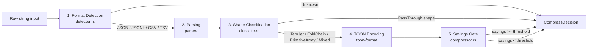
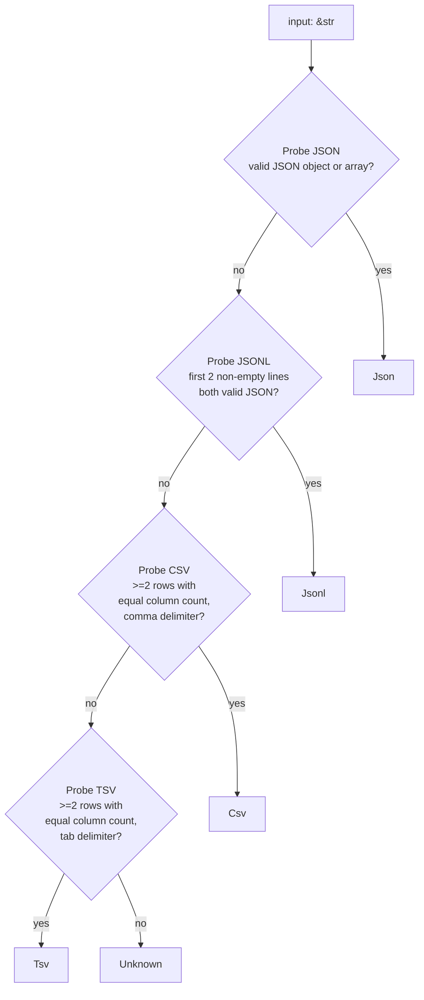
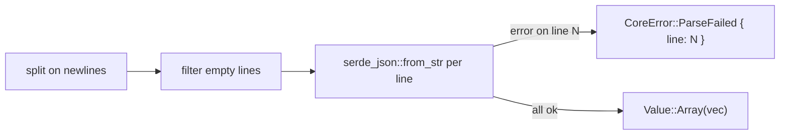
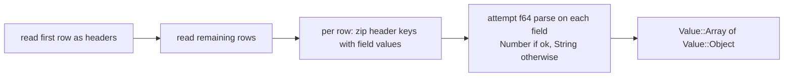
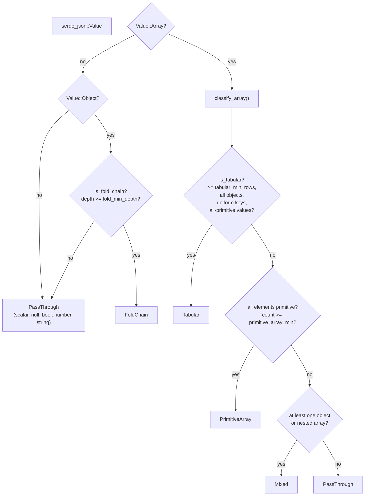
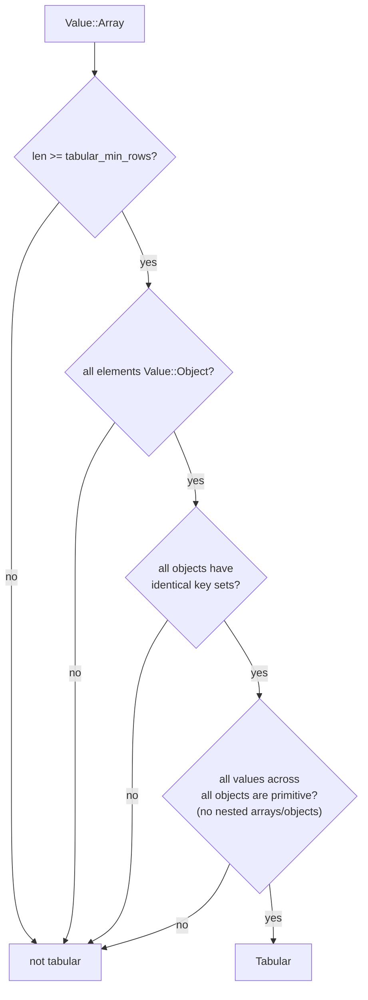
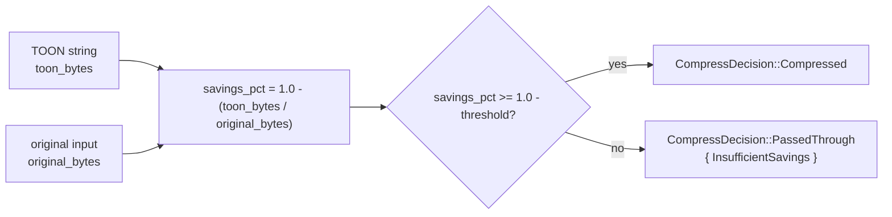
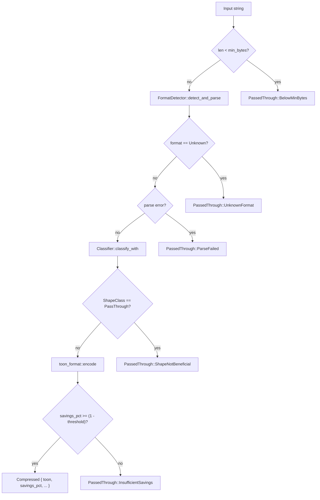

# Algorithms

This document explains the three-stage pipeline that every `compress_content` and `compression_stats` call traverses: format detection, shape classification, and TOON encoding with a savings gate.

---

## Overview



All stages before `Gate` execute synchronously inside `Compressor::decide`. There is no I/O.

---

## Stage 1: Format Detection

**Source:** `crates/toon-mcp-core/src/detector.rs`

The detector applies a sequence of probes to the raw input string. The first probe to succeed wins. Probes are ordered from most specific to least.



### JSON Probe

Attempts `serde_json::from_str::<Value>`. Succeeds only if the input is valid JSON — any leading/trailing whitespace is tolerated by `serde_json`.

### JSONL Probe

Collects the first two non-empty lines (after trimming whitespace) and attempts to parse each as JSON. Both must succeed. A single-line input with valid JSON would have passed the JSON probe first, so JSONL only fires if the JSON probe failed — which in practice means the input has multiple lines where the first line is valid JSON but the full content is not.

```rust
fn probe_jsonl(input: &str) -> bool {
    let lines: Vec<&str> = input
        .lines()
        .map(str::trim)
        .filter(|l| !l.is_empty())
        .take(2)
        .collect();
    lines.len() >= 2
        && lines
            .iter()
            .all(|l| serde_json::from_str::<Value>(l).is_ok())
}
```

### CSV / TSV Probe

The delimited probe reads the header row and checks two conditions:

1. The header row has at least two columns
2. The first data record has the same column count as the header

This avoids false positives on prose text that happens to contain commas. The
probe does not validate field contents — numeric coercion happens in the
parser, not the detector.

```rust
fn probe_delimited(input: &str, delimiter: u8) -> bool {
    let mut rdr = csv::ReaderBuilder::new()
        .delimiter(delimiter)
        .has_headers(true)
        .from_reader(input.as_bytes());

    let headers = match rdr.headers() {
        Ok(h) => h.len(),
        Err(_) => return false,
    };

    if headers < 2 {
        return false;
    }

    // Check that the first data record has the same column count.
    match rdr.records().next() {
        Some(Ok(record)) => record.len() == headers,
        _ => false,
    }
}
```

### Probe Ordering Rationale

CSV is probed before TSV because comma-delimited data is more common. JSON is probed before JSONL because a valid JSON array would also satisfy the JSONL probe (every line of a pretty-printed JSON array could be valid JSON fragments on its own — actually not true for most, but the strict probe ordering prevents ambiguity).

---

## Stage 2: Parsing

**Source:** `crates/toon-mcp-core/src/parser/`

All parsers implement the `Parser` trait:

```rust
pub trait Parser: Send + Sync {
    fn parse(&self, input: &str) -> Result<serde_json::Value, CoreError>;
}
```

All parsers return `serde_json::Value`. The classifier and compressor never see the original format string — they operate on the normalized value tree.

### JSON Parser

Thin wrapper around `serde_json::from_str`. No transformation.

### JSONL Parser



The parser wraps all parsed values in a `Value::Array`. This is critical: it preserves the signal that the collection is uniform, which the classifier then detects.

### CSV / TSV Parser



Numeric coercion ensures that a column like `salary` containing `"75000"` becomes `Value::Number(75000.0)` rather than `Value::String("75000")`. This matters for downstream TOON encoding efficiency.

---

## Stage 3: Shape Classification

**Source:** `crates/toon-mcp-core/src/classifier.rs`

The classifier walks the `Value` tree and assigns one of five shape classes. Classification priority is fixed — the first matching rule wins.



### ShapeClass Enum

| Class            | TOON benefit                                            | Example                                           |
| ---------------- | ------------------------------------------------------- | ------------------------------------------------- |
| `Tabular`        | High — repeated keys eliminated, rows encoded compactly | JSON array of uniform objects, CSV, uniform JSONL |
| `FoldChain`      | High — deeply nested single-key objects flattened       | `{ "a": { "b": { "c": { "d": "val" } } } }`       |
| `PrimitiveArray` | Moderate — dense numeric/string encoding                | `[1, 2, 3, 4, 5, 6, 7]`                           |
| `Mixed`          | Low-moderate — partial structural benefit               | Heterogeneous arrays with some objects            |
| `PassThrough`    | None — TOON would not reduce size                       | Single string, single number, scalar object       |

### Tabular Detection



The uniform-key check uses the key set of the first object as the reference and compares every subsequent object against it using `BTreeMap` key iteration.

### Fold Chain Detection

A fold chain is a `Value::Object` where every level has exactly one key, and the value of that key is either another single-key object or any terminal value. The classifier counts the depth recursively.

```rust
fn is_fold_chain(value: &Value, depth: usize, min_depth: usize) -> bool {
    match value {
        Value::Object(map) if map.len() == 1 => {
            let child = map.values().next().unwrap();
            is_fold_chain(child, depth + 1, min_depth)
        }
        _ => depth >= min_depth,
    }
}
```

A chain of depth 6 (like `fixtures/deep_fold.json`) produces a path like `level_a.level_b.level_c.level_d.level_e.level_f` in TOON key-folding mode, which is far shorter than the nested JSON representation.

### Configuration Thresholds

All three numeric thresholds are configurable via environment variables and passed to `Classifier::classify_with` at call time:

| Threshold             | Constant              | Default |
| --------------------- | --------------------- | ------- |
| `tabular_min_rows`    | `TABULAR_MIN_ROWS`    | `3`     |
| `fold_min_depth`      | `FOLD_MIN_DEPTH`      | `3`     |
| `primitive_array_min` | `PRIMITIVE_ARRAY_MIN` | `5`     |

---

## Stage 4: TOON Encoding

**Source:** `crates/toon-mcp-core/src/compressor.rs`, external `toon-format` crate

TOON encoding is delegated to the `toon-format` crate via `toon_format::encode`. The server configures two parameters:

**`KeyFoldingMode`** — controlled by `TOON_KEY_FOLDING`:

- When enabled, nested single-key objects are collapsed into dot-notation paths: `{ "a": { "b": "val" } }` → `a.b: val`
- Applied most aggressively to `FoldChain` shaped inputs

**`Delimiter`** — controlled by `TOON_DELIMITER` (`comma`, `tab`, `pipe`):

- The character separating values within a tabular row
- `tab` tends to produce smaller output for text-heavy columns; `comma` is more readable

The `toon-format` crate docs: https://docs.rs/toon-format/latest/toon_format/

---

## Stage 5: Savings Gate

**Source:** `crates/toon-mcp-core/src/compressor.rs`

After encoding, the compressor checks whether the size reduction meets the configured threshold before committing to the compressed output.



**Example with `TOON_COMPRESSION_THRESHOLD = 0.85`:**

- Input: 10,000 bytes
- TOON output: 8,000 bytes
- `savings_pct = 1.0 - (8000 / 10000) = 0.20`
- Required: `savings_pct >= 1.0 - 0.85 = 0.15`
- Result: `Compressed` (0.20 >= 0.15)

**Example that fails the gate:**

- Input: 10,000 bytes
- TOON output: 9,200 bytes
- `savings_pct = 1.0 - (9200 / 10000) = 0.08`
- Required: >= 0.15
- Result: `PassedThrough { InsufficientSavings { estimated_pct: 0.08, threshold: 0.85 } }`

---

## Complete Decision Tree



---

## Benchmark Coverage

The `toon-mcp-bench` crate measures each stage independently:

| Benchmark file              | What it measures                                                                 |
| --------------------------- | -------------------------------------------------------------------------------- |
| `benches/detection.rs`      | `FormatDetector::detect` only — 6 input shapes                                   |
| `benches/classification.rs` | `Classifier::classify` only — pre-parsed values, 6 shape classes                 |
| `benches/compression.rs`    | Full `Compressor::decide` pipeline — 6 input shapes including pass-through paths |

All benchmarks use Criterion with `Throughput::Bytes` measurement, enabling bytes/sec comparison across input sizes. Baseline snapshots are committed to `bench/baselines/`.

---

## Complexity Notes

| Stage                     | Complexity                           | Notes                                                              |
| ------------------------- | ------------------------------------ | ------------------------------------------------------------------ |
| Format detection          | O(L) where L = first few lines       | JSONL and CSV probes read at most 3 lines                          |
| JSON parsing              | O(N)                                 | Standard `serde_json` DFS                                          |
| JSONL parsing             | O(N)                                 | Linear scan of all lines                                           |
| CSV parsing               | O(N)                                 | Linear scan of all rows                                            |
| Tabular classification    | O(R x C) where R = rows, C = columns | Uniform-key check is O(C) per row                                  |
| Fold chain classification | O(D) where D = chain depth           | Recursive descent, terminates on first non-singleton or non-object |
| TOON encoding             | O(N)                                 | Single-pass encoding by `toon-format`                              |

All stages are well within microsecond range for typical LLM context payloads (< 1 MB). The benchmark suite provides concrete throughput numbers for regression tracking.
