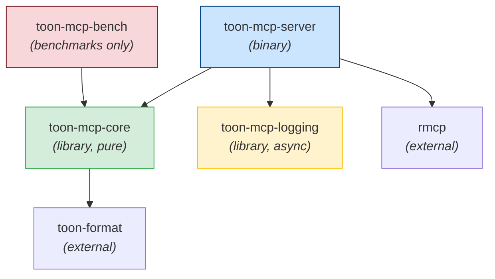
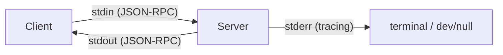
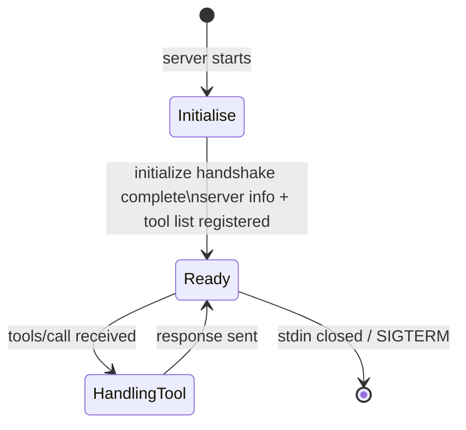
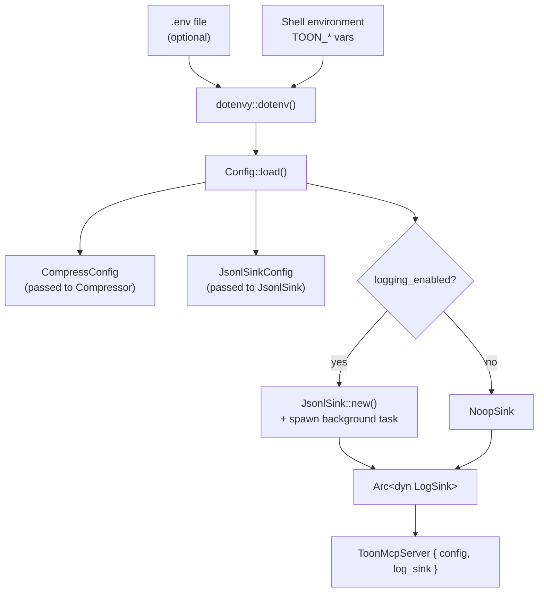
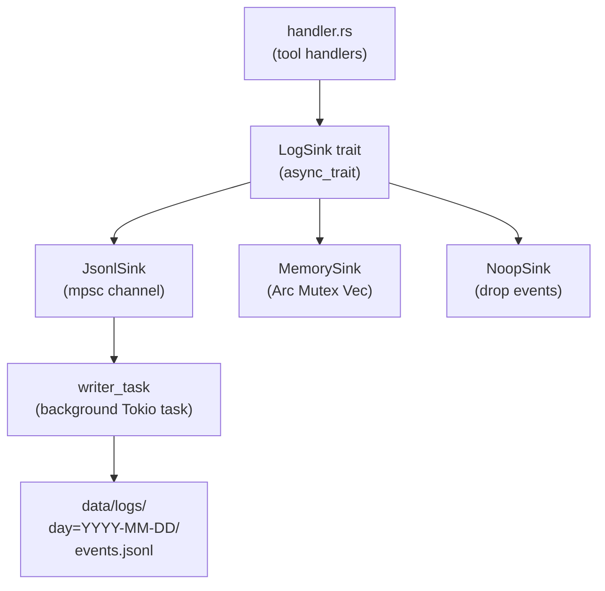

# Architecture

This document describes the crate structure, dependency graph, data flow, and key design decisions in toon-mcp.

---

## Crate Dependency Graph



**Layer rules (enforced — no upward calls permitted):**

- `toon-mcp-server` may call into `toon-mcp-core` and `toon-mcp-logging`
- `toon-mcp-core` has zero workspace dependencies beyond `toon-format`, `serde_json`, `serde`, `csv`, and `thiserror`
- `toon-mcp-logging` has no dependency on `toon-mcp-core`
- `toon-mcp-bench` depends on `toon-mcp-core` (sync benches) and may additionally depend on `toon-mcp-logging` for dedicated async benches
- No crate imports `rmcp` except `toon-mcp-server`

---

## Crate Responsibilities

### `toon-mcp-core`

The computational heart of the system. Deliberately pure — no I/O, no async, no network, no runtime.

| Module          | Role                                                                       |
| --------------- | -------------------------------------------------------------------------- |
| `detector.rs`   | Probe input bytes to determine format (JSON / JSONL / CSV / TSV / Unknown) |
| `parser/`       | Parse raw strings into `serde_json::Value` — one submodule per format      |
| `classifier.rs` | Walk the `Value` tree and assign a `ShapeClass`                            |
| `compressor.rs` | Orchestrate the full pipeline; decide compress vs. pass-through            |
| `error.rs`      | Typed errors via `thiserror`                                               |

### `toon-mcp-logging`

Async event recording. Decoupled from the core pipeline via the `LogSink` trait — the server never imports a concrete sink directly from handler code.

| Module           | Role                                                                                                                                       |
| ---------------- | ------------------------------------------------------------------------------------------------------------------------------------------ |
| `sink.rs`        | `LogSink` async trait                                                                                                                      |
| `event.rs`       | `LogEvent` struct (all fields flat, all serializable)                                                                                      |
| `jsonl_sink.rs`  | Production sink: buffers events in memory, flushes to hive-partitioned JSONL via `spawn_blocking`; holds file handles open between flushes |
| `memory_sink.rs` | Test sink: accumulates events in a `Vec` behind `Arc<Mutex<>>`                                                                             |
| `noop_sink.rs`   | Zero-cost sink for benchmarks or disabled logging                                                                                          |
| `error.rs`       | `LogError`                                                                                                                                 |

### `toon-mcp-server`

The runnable binary. Owns startup, configuration, and MCP protocol registration.

| Module       | Role                                                                                     |
| ------------ | ---------------------------------------------------------------------------------------- |
| `main.rs`    | Tokio entry point: load config, construct sink, spawn background task, serve stdio       |
| `config.rs`  | Parse `TOON_*` env vars into a typed `Config` struct                                     |
| `server.rs`  | Register `ToonMcpServer` with `rmcp`, declare tool router, set server info               |
| `handler.rs` | All four tool implementations: `detect_format`, `compress_content`, `compression_stats`, `toon_diagnostics` |
| `error.rs`   | `ServerError` for startup failures                                                       |

### `toon-mcp-bench`

Criterion benchmark suite. Four benchmark binaries:

| Bench file          | Scope                                                 | Runtime                  |
| ------------------- | ----------------------------------------------------- | ------------------------ |
| `detection.rs`      | Sync core: format detection                           | None                     |
| `classification.rs` | Sync core: shape classification                       | None                     |
| `compression.rs`    | Sync core: full compression pipeline                  | None                     |
| `jsonl_sink.rs`     | Async logging sink: channel throughput, flush latency | `tokio` `current_thread` |

The three sync core benches depend only on `toon-mcp-core` and MUST NOT start a tokio runtime. The dedicated `jsonl_sink.rs` async bench depends on `toon-mcp-logging` and is the only place a tokio runtime is permitted in this crate — it exists to measure async-specific behaviour (channel throughput, flush latency) that cannot be measured synchronously. The bench crate never depends on `toon-mcp-server`. The async-benches exception is documented in [ADR-0001](adr/0001-async-benches.md).

---

## System Data Flow

```mermaid
sequenceDiagram
    participant Client as MCP Client<br/>(opencode / Claude Desktop)
    participant Server as toon-mcp-server<br/>(stdio JSON-RPC)
    participant Handler as handler.rs
    participant Core as toon-mcp-core
    participant Sink as JsonlSink<br/>(background task)

    Client->>Server: tools/call { name, params }
    Server->>Handler: dispatch via tool_router
    Handler->>Core: FormatDetector::detect_and_parse(input)
    Core-->>Handler: (InputFormat, serde_json::Value)
    Handler->>Core: Classifier::classify_with(value, config)
    Core-->>Handler: ShapeClass
    Handler->>Core: toon_format::encode(value, ...)
    Core-->>Handler: encoded TOON string
    Handler->>Sink: LogSink::record(LogEvent) [fire-and-forget]
    Handler-->>Server: CallToolResult { content }
    Server-->>Client: JSON-RPC response
    Sink->>Sink: buffer event; flush to JSONL on tick/threshold
```

---

## MCP Transport

The server communicates via **stdio JSON-RPC** — standard input receives requests, standard output emits responses. This is the universal MCP transport supported by all clients.

Tracing logs (`tracing_subscriber`) write to **stderr only**, never stdout, to avoid corrupting the JSON-RPC stream.



The MCP session lifecycle:



---

## Configuration Flow



---

## Logging Architecture

The logging subsystem is intentionally decoupled from the tool pipeline via the `LogSink` trait. Handlers hold an `Arc<dyn LogSink>` and call `record()` with fire-and-forget semantics — logging errors are silently discarded so they never affect tool response latency or correctness.



The `JsonlSink` channel pattern means file handles live exclusively on the background `writer_task` — they are never shared across threads, eliminating the need for `Arc<Mutex<Handle>>`.

For full details, see [logging.md](logging.md).

---

## Key Design Decisions

### 1. Format-Agnostic Core

All parsers normalize output to `serde_json::Value`. The classifier and compressor have **zero awareness** of the original input format. This means:

- Tabular JSONL and tabular CSV take identical code paths through classification and compression
- Adding a new input format (e.g., TSV with different quoting) only requires a new parser — classifier and compressor need no changes
- Benchmarks can test classification independently of parsing

### 2. No Async in Core

`toon-mcp-core` is synchronous. This keeps the library usable in any context (sync test runners, Criterion benchmarks) and eliminates the need to reason about executor selection or `spawn_blocking` inside core logic. The server crate wraps core calls appropriately.

### 3. Trait-Based Sinks, Not Concrete Types

Handlers accept `Arc<dyn LogSink>` rather than a concrete sink type. This makes it trivial to:

- Use `MemorySink` in unit tests to assert event fields
- Use `NoopSink` in benchmarks to eliminate I/O overhead from measurements
- Swap in a future alternative sink without touching handler code

### 4. Single Background Writer Task

Rather than `Arc<Mutex<File>>` (which would require holding a mutex guard across `await` points, violating Rust's borrow rules), `JsonlSink` sends events over an `mpsc` channel to a single Tokio task that exclusively owns all file handles. This pattern:

- Eliminates lock contention
- Avoids `MutexGuard` held across `.await`
- Serializes writes naturally without explicit synchronization

### 5. Compression Is a Gate, Not a Mandate

`Compressor::decide` returns a `CompressDecision` enum, not a `Result<String>`. There are five distinct reasons a payload may pass through unchanged, each observable in logs and tool output. This gives LLM clients full transparency into why a given payload was not compressed.

### 6. Threshold Semantics

`TOON_COMPRESSION_THRESHOLD` (default `0.85`) means: "the TOON output must be at most 85% of the input byte count." A threshold of `1.0` would accept any output smaller than the input; a threshold of `0.5` requires at least 50% reduction.

This is expressed in code as:

```
savings_pct = 1.0 - (toon_bytes as f64 / original_bytes as f64)
// pass through if savings_pct < (1.0 - threshold)
```

---

## Error Handling Strategy

| Crate              | Error type    | Approach                                                   |
| ------------------ | ------------- | ---------------------------------------------------------- |
| `toon-mcp-core`    | `CoreError`   | `thiserror` enum, propagated with `?`                      |
| `toon-mcp-logging` | `LogError`    | `thiserror` enum, silently discarded by handlers           |
| `toon-mcp-server`  | `ServerError` | `thiserror` enum, fatal — exits process on startup failure |

No `Box<dyn Error>` in any public API. No `anyhow` in library crates. `.unwrap()` and `.expect()` are permitted only in tests and in `main.rs` where a panic is acceptable.
