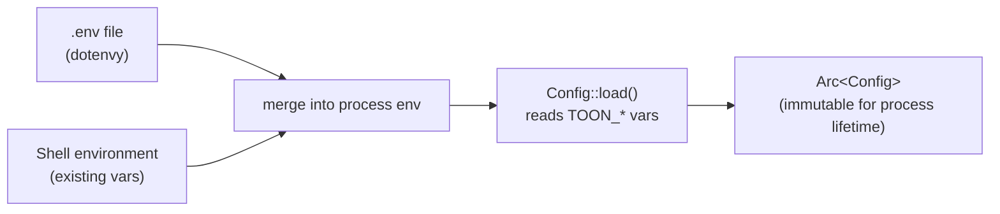
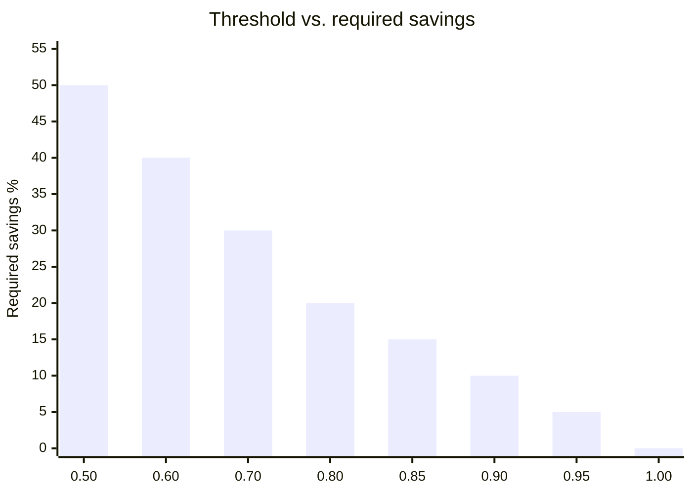

# Configuration

toon-mcp is configured exclusively through environment variables. There are no config files, command-line flags, or runtime mutation. All values are read once at startup in `Config::load()` and distributed as an immutable `Arc<Config>`.

---

## Loading Precedence



Shell environment variables take precedence over `.env` values — `dotenvy` only sets a variable if it is not already present in the environment.

---

## Full Variable Reference

### Compression Behavior

| Variable | Type | Default | Description |
|---|---|---|---|
| `TOON_COMPRESSION_THRESHOLD` | `f64` (0.0–1.0) | `0.85` | Maximum fraction of the original byte count that the TOON output may occupy. An input of 10,000 bytes with `threshold=0.85` must produce output ≤ 8,500 bytes to be considered compressed. |
| `TOON_MIN_BYTES` | `usize` | `256` | Inputs shorter than this byte count are passed through without any processing. Avoids overhead on small strings that will never compress meaningfully. |
| `TOON_KEY_FOLDING` | `bool` | `true` | Enable TOON key-folding mode. When enabled, deeply nested single-key objects are collapsed to dot-notation paths. Disable if your consumer of TOON output does not support key folding. |
| `TOON_DELIMITER` | `string` | `comma` | The delimiter character used between values in TOON tabular output. Accepted values: `comma`, `tab`, `pipe`. |

### Classification Thresholds

These control the minimum structural requirements for each shape class. Inputs that fall below the threshold are classified as `PassThrough` and not compressed.

| Variable | Type | Default | Corresponding constant |
|---|---|---|---|
| `TOON_TABULAR_MIN_ROWS` | `usize` | `3` | `TABULAR_MIN_ROWS` |
| `TOON_FOLD_MIN_DEPTH` | `usize` | `3` | `FOLD_MIN_DEPTH` |
| `TOON_PRIMITIVE_ARRAY_MIN` | `usize` | `5` | `PRIMITIVE_ARRAY_MIN` |

### Logging

| Variable | Type | Default | Description |
|---|---|---|---|
| `TOON_LOG_ENABLED` | `bool` | `true` | Enable structured event logging to JSONL files. When `false`, a `NoopSink` is used and no events are written. |
| `TOON_LOG_DIR` | `string` | `data/logs` | Directory where hive-partitioned JSONL log files are written. **Must be an absolute path** when the server is launched by Claude Desktop. |
| `TOON_LOG_BUFFER_SIZE` | `usize` | `1000` | Number of events held in memory before the background writer task forces a flush to disk. |
| `TOON_LOG_FLUSH_INTERVAL_SECS` | `u64` | `300` | Periodic flush interval in seconds. Events older than this will be flushed even if the buffer is not full. |

### Observability

| Variable | Type | Default | Description |
|---|---|---|---|
| `TOON_LOG_LEVEL` | `string` | `info` | Tracing log level for stderr output. Accepted values: `trace`, `debug`, `info`, `warn`, `error`. |
| `TOON_CLIENT_HINT` | `string` | _(none)_ | Arbitrary label attached to every `LogEvent`. Use this to distinguish traffic from different MCP clients when multiple clients share the same server (e.g., `"opencode"`, `"claude-desktop"`, `"ci"`). |

---

## Boolean Parsing

`env_bool` accepts the following values case-insensitively:

| Truthy | Falsy |
|---|---|
| `true`, `1`, `yes` | `false`, `0`, `no` |

Any other value causes `Config::load()` to log a warning and use the default.

---

## Delimiter Parsing

`env_delimiter` accepts (case-insensitive):

| Value | Delimiter character |
|---|---|
| `comma` | `,` |
| `tab` | `\t` |
| `pipe` | `\|` |

---

## Threshold Semantics in Depth

The `TOON_COMPRESSION_THRESHOLD` value is inverted relative to what you might expect from a "savings percentage":

```
threshold = 0.85
→ output must be ≤ 85% of input bytes
→ minimum savings = 15%
```



**Practical guidance:**

- `0.85` (default) — accepts inputs that compress by at least 15%. Suitable for typical JSON API responses with repeated keys.
- `0.70` — requires 30% savings; filters out inputs with low redundancy.
- `0.95` — accepts almost any positive compression; maximizes compressed output volume.
- `1.00` — pass through unless TOON output is strictly smaller than input (useful for testing the encoding path).

---

## Classification Threshold Guidance

### `TOON_TABULAR_MIN_ROWS` (default: 3)

Setting this lower (e.g., `2`) compresses two-row arrays but provides minimal savings — the header overhead in TOON tabular format is only worthwhile with several rows.

Setting this higher (e.g., `10`) reserves tabular encoding for larger collections. For APIs that typically return small result sets, increasing this avoids compressing inputs that would not compress well.

### `TOON_FOLD_MIN_DEPTH` (default: 3)

A depth of `3` means a chain must be at least `a → b → c → leaf` to qualify. Shallower chains (`a → b → leaf`, depth 2) would be classified as `PassThrough` or `Mixed`.

Lower values compress shallower nesting but may produce false positives on normal nested objects. The default of `3` matches common API response patterns like `response.data.items`.

### `TOON_PRIMITIVE_ARRAY_MIN` (default: 5)

Arrays of numbers or strings below this size produce negligible savings. The default of `5` ensures the TOON overhead of encoding mode markers is amortized across enough elements.

---

## Example Configurations

### Aggressive compression (maximum token savings)

```bash
TOON_COMPRESSION_THRESHOLD=0.95
TOON_MIN_BYTES=128
TOON_TABULAR_MIN_ROWS=2
TOON_FOLD_MIN_DEPTH=2
TOON_PRIMITIVE_ARRAY_MIN=3
```

### Conservative compression (only high-confidence wins)

```bash
TOON_COMPRESSION_THRESHOLD=0.70
TOON_MIN_BYTES=1024
TOON_TABULAR_MIN_ROWS=10
TOON_FOLD_MIN_DEPTH=4
TOON_PRIMITIVE_ARRAY_MIN=10
```

### Logging disabled (zero I/O overhead)

```bash
TOON_LOG_ENABLED=false
```

### High-throughput logging

```bash
TOON_LOG_BUFFER_SIZE=5000
TOON_LOG_FLUSH_INTERVAL_SECS=60
```

### Claude Desktop absolute paths

```json
{
  "mcpServers": {
    "toon": {
      "command": "/Users/you/projects/toon-mcp/target/release/toon-mcp-server",
      "env": {
        "TOON_LOG_DIR": "/Users/you/projects/toon-mcp/data/logs",
        "TOON_CLIENT_HINT": "claude-desktop"
      }
    }
  }
}
```

**Claude Desktop does not inherit your shell environment.** All paths must be absolute. Relative paths like `data/logs` will resolve relative to Claude Desktop's working directory, which is typically your home directory — not the project directory.

---

## Config Struct

**Source:** `crates/toon-mcp-server/src/config.rs`

```rust
pub struct Config {
    pub compression_threshold: f64,
    pub min_bytes: usize,
    pub key_folding: bool,
    pub delimiter: Delimiter,
    pub tabular_min_rows: usize,
    pub fold_min_depth: usize,
    pub primitive_array_min: usize,
    pub logging_enabled: bool,
    pub logging: JsonlSinkConfig,
    pub log_level: String,
    pub client_hint: Option<String>,
}
```

`CompressConfig` is derived from `Config` fields in each handler call:

```rust
let compress_config = CompressConfig {
    threshold: config.compression_threshold,
    min_bytes: config.min_bytes,
    key_folding: config.key_folding,
    delimiter: config.delimiter,
    tabular_min_rows: config.tabular_min_rows,
    fold_min_depth: config.fold_min_depth,
    primitive_array_min: config.primitive_array_min,
};
```

---

## Startup Validation

`Config::load()` does not panic on invalid values — it logs a `tracing::warn!` and substitutes the default. This prevents the server from crashing on misconfiguration, at the cost of possibly running with unexpected defaults. Watch stderr during startup to verify all values loaded correctly:

```
[INFO] toon_mcp_server::config: loaded config compression_threshold=0.85 min_bytes=256 ...
```
