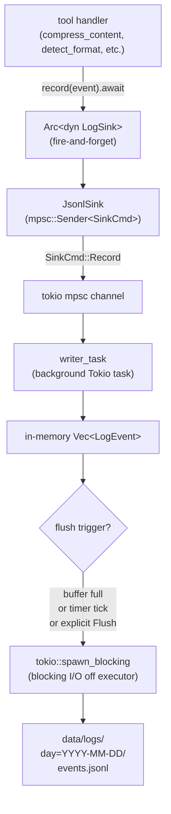
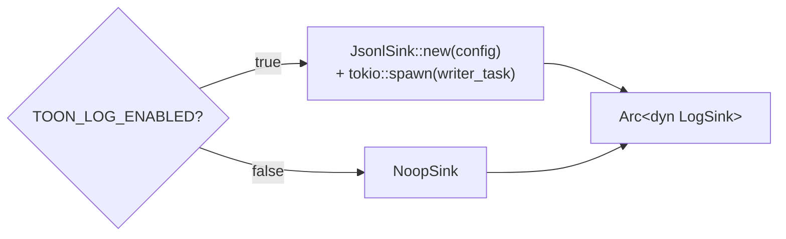

# Logging

toon-mcp records a structured `LogEvent` for every tool invocation. Events are written to hive-partitioned JSONL files and are queryable directly with DuckDB, Polars, or any tool that reads JSONL.

---

## Overview



---

## LogSink Trait

**Source:** `crates/toon-mcp-logging/src/sink.rs`

```rust
#[async_trait]
pub trait LogSink: Send + Sync + 'static {
    async fn record(&self, event: LogEvent) -> Result<(), LogError>;
    async fn flush(&self) -> Result<(), LogError>;
    async fn shutdown(self: Box<Self>) -> Result<(), LogError>;
}
```

Handlers call `record` with fire-and-forget semantics — the returned `Result` is discarded with `let _ = ...`. This ensures that logging errors never affect tool response latency or correctness. If the channel is full or a flush fails, the error is silently dropped.

---

## Available Sink Implementations

| Sink         | Use case                                                                     |
| ------------ | ---------------------------------------------------------------------------- |
| `JsonlSink`  | Production — writes hive-partitioned JSONL to `TOON_LOG_DIR`                 |
| `MemorySink` | Unit tests — accumulates events in `Arc<Mutex<Vec<LogEvent>>>` for assertion |
| `NoopSink`   | Benchmarks or disabled logging — drops all events immediately                |

The server selects the sink at startup based on `TOON_LOG_ENABLED`:



---

## LogEvent Schema

**Source:** `crates/toon-mcp-logging/src/event.rs`

Every tool invocation produces one `LogEvent` with the following fields:

| Field            | Type              | Description                                                                      |
| ---------------- | ----------------- | -------------------------------------------------------------------------------- |
| `event_id`       | `String`          | 16-character lowercase hex identifier; unique within one process run, not cryptographic and not globally unique |
| `ts_us`          | `i64`             | Unix timestamp in microseconds                                                   |
| `tool_name`      | `String`          | `"compress_content"`, `"compression_stats"`, or `"detect_format"`                |
| `input_format`   | `String`          | `"json"`, `"jsonl"`, `"csv"`, `"tsv"`, or `"unknown"`                            |
| `shape_class`    | `String`          | `"tabular"`, `"fold_chain"`, `"primitive_array"`, `"mixed"`, or `"pass_through"` |
| `input_bytes`    | `u64`             | Byte length of the raw input string                                              |
| `output_bytes`   | `u64`             | Byte length of the output (equals `input_bytes` when not compressed)             |
| `compressed`     | `bool`            | Whether compression was applied                                                  |
| `savings_pct`    | `f64`             | Fraction of bytes saved (0.0 when not compressed)                                |
| `threshold_used` | `f64`             | The `TOON_COMPRESSION_THRESHOLD` value active at call time                       |
| `duration_us`    | `u64`             | Wall-clock time in microseconds for the detect + classify + encode pipeline      |
| `outcome`        | `String`          | `"ok"`, `"rejected"`, `"timeout"`, `"busy"`, or `"failed"` (see below)           |
| `pass_reason`    | `Option<String>`  | If `compressed=false`, the reason (see below)                                    |
| `client_hint`    | `Option<String>`  | Value of `TOON_CLIENT_HINT` at startup, or `null`                                |

### `outcome` values

Added after the initial schema; rows written by earlier releases lack the field and deserialise as `"ok"`.

| Value        | Meaning                                                                    |
| ------------ | -------------------------------------------------------------------------- |
| `"ok"`       | The tool returned a successful response                                     |
| `"rejected"` | The input was rejected before processing (e.g. above `TOON_MAX_INPUT_BYTES`) |
| `"timeout"`  | The pipeline exceeded `TOON_PIPELINE_TIMEOUT_MS`                            |
| `"busy"`     | No concurrency permit became available within the queue deadline            |
| `"failed"`   | An internal failure (e.g. the blocking task crashed)                        |

### `pass_reason` values

| Value                              | Meaning                                                    |
| ---------------------------------- | ---------------------------------------------------------- |
| `"unknown_format"`                 | Format detection returned `Unknown`                        |
| `"below_min_bytes"`                | Input shorter than `TOON_MIN_BYTES`                        |
| `"insufficient_savings"`           | Compression succeeded but savings below threshold          |
| `"shape_not_beneficial"`           | Classifier returned `PassThrough`                          |
| `"parse_failed:<format>:<detail>"` | Parsing succeeded format detection but failed actual parse |

---

## JsonlSink Internals

**Source:** `crates/toon-mcp-logging/src/jsonl_sink.rs`

### Command Channel

`JsonlSink` holds only an `mpsc::Sender<SinkCmd>`. The actual file handles live on the background `writer_task`. This eliminates the need for `Arc<Mutex<FileHandle>>` and ensures I/O resources are never shared across tasks.

```rust
enum SinkCmd {
    Record(LogEvent),
    Flush,
    Shutdown(oneshot::Sender<Result<(), LogError>>),
}
```

### Writer Task Lifecycle

```mermaid
stateDiagram-v2
    [*] --> Waiting: writer_task started
    Waiting --> Buffering: SinkCmd::Record received
    Buffering --> Buffering: more records received
    Buffering --> Flushing: buffer >= buffer_size
    Waiting --> Flushing: timer tick (flush_interval)
    Buffering --> Flushing: timer tick
    Flushing --> Waiting: flush_pending() complete
    Waiting --> Shutdown: SinkCmd::Shutdown received
    Buffering --> Shutdown: SinkCmd::Shutdown received
    Shutdown --> [*]: oneshot ack sent
```

### Hive Partitioning

Events are grouped by UTC day before writing. The partition key is derived from `ts_us`:

```rust
fn day_partition_key(ts_us: i64) -> String {
    // produces "YYYY-MM-DD"
    let dt = DateTime::from_timestamp_micros(ts_us).unwrap();
    dt.format("%Y-%m-%d").to_string()
}
```

The directory layout:

```
data/logs/
  day=2026-04-06/
    events.jsonl
  day=2026-04-07/
    events.jsonl
```

Each `events.jsonl` contains newline-delimited JSON objects, one per event. Events from the same flush batch that span a day boundary are written to their respective partition files in a single flush operation.

### Blocking I/O on a Tokio Executor

File writes use `tokio::task::spawn_blocking` to move the blocking I/O off the async executor thread pool:

```rust
let events_clone = pending_events.clone();
let path_clone = path.clone();
spawn_blocking(move || {
    let file = OpenOptions::new().create(true).append(true).open(&path_clone)?;
    let mut writer = BufWriter::new(file);
    for event in &events_clone {
        serde_json::to_writer(&mut writer, event)?;
        writer.write_all(b"\n")?;
    }
    writer.flush()?;
    Ok::<(), std::io::Error>(())
})
.await??;
```

This is required because the Tokio runtime's async tasks should not call blocking system calls — doing so would stall other tasks sharing the same executor thread.

---

## Querying Logs with DuckDB

The JSONL files are directly readable by DuckDB using the `read_json` glob function. No import step required.

### Basic query

```sql
SELECT *
FROM read_json('data/logs/**/*.jsonl')
ORDER BY ts_us DESC
LIMIT 50;
```

### Compression rate by tool

```sql
SELECT
    tool_name,
    count(*) AS total_calls,
    sum(compressed::int) AS compressed_count,
    round(avg(savings_pct) FILTER (WHERE compressed) * 100, 1) AS avg_savings_pct,
    sum(input_bytes - output_bytes) AS total_bytes_saved
FROM read_json('data/logs/**/*.jsonl')
GROUP BY tool_name
ORDER BY total_calls DESC;
```

### Failure breakdown by outcome

```sql
SELECT
    tool_name,
    coalesce(outcome, 'ok') AS outcome,
    count(*) AS n
FROM read_json('data/logs/**/*.jsonl')
GROUP BY tool_name, coalesce(outcome, 'ok')
ORDER BY tool_name, n DESC;
```

`coalesce` keeps the query correct across rows written before the `outcome` field existed.

### Pass-through breakdown

```sql
SELECT
    pass_reason,
    count(*) AS n,
    round(count(*) * 100.0 / sum(count(*)) OVER (), 1) AS pct
FROM read_json('data/logs/**/*.jsonl')
WHERE compressed = false
GROUP BY pass_reason
ORDER BY n DESC;
```

### Compression by input format

```sql
SELECT
    input_format,
    count(*) AS calls,
    round(avg(savings_pct) FILTER (WHERE compressed) * 100, 1) AS avg_savings_pct,
    sum(compressed::int) AS compressed_count
FROM read_json('data/logs/**/*.jsonl')
GROUP BY input_format
ORDER BY avg_savings_pct DESC NULLS LAST;
```

### Latency percentiles

```sql
SELECT
    tool_name,
    percentile_cont(0.5) WITHIN GROUP (ORDER BY duration_us) AS p50_us,
    percentile_cont(0.95) WITHIN GROUP (ORDER BY duration_us) AS p95_us,
    percentile_cont(0.99) WITHIN GROUP (ORDER BY duration_us) AS p99_us,
    max(duration_us) AS max_us
FROM read_json('data/logs/**/*.jsonl')
GROUP BY tool_name;
```

### Client breakdown (when multiple clients share a server)

```sql
SELECT
    client_hint,
    count(*) AS calls,
    sum(compressed::int) AS compressed,
    sum(input_bytes - output_bytes) AS bytes_saved
FROM read_json('data/logs/**/*.jsonl')
GROUP BY client_hint;
```

### Daily call volume

```sql
SELECT
    strftime(to_timestamp(ts_us / 1_000_000), '%Y-%m-%d') AS day,
    count(*) AS calls,
    sum(compressed::int) AS compressed,
    sum(input_bytes - output_bytes) AS bytes_saved
FROM read_json('data/logs/**/*.jsonl')
GROUP BY day
ORDER BY day DESC;
```

---

## Testing Sinks

### MemorySink

**Source:** `crates/toon-mcp-logging/src/memory_sink.rs`

`MemorySink` provides an observable event store for integration tests:

```rust
let (sink, events) = MemorySink::new();
let arc_sink: Arc<dyn LogSink> = Arc::new(sink);

// ... call a handler that uses arc_sink ...

let recorded = events.lock().unwrap();
assert_eq!(recorded.len(), 1);
assert_eq!(recorded[0].tool_name, "compress_content");
assert!(recorded[0].compressed);
```

The `Arc<Mutex<Vec<LogEvent>>>` handle returned by `MemorySink::new()` can be cloned and inspected after any number of calls without holding a reference to the sink itself.

---

## Durability Semantics

JSONL logs are best-effort telemetry, not audit-grade records. Tool handlers preserve response success even when logging fails, and handler-level code currently discards `LogSink::record` errors. The writer task batches events in memory and flushes on buffer size, timer, explicit shutdown flush, or sink shutdown.

Operational consequences:

- A process crash can lose events that were accepted into the in-memory channel but not flushed.
- A disk, permission, or channel failure can drop log events while tool calls continue.
- `writer.flush()` flushes the process buffer to the OS; the implementation does not call `sync_data` or `sync_all` for fsync-style durability.
- There is no inter-process locking. Run at most one `toon-mcp-server` process per `TOON_LOG_DIR`.

Use these logs for observability, capacity planning, and troubleshooting. Do not use them as the sole audit trail for regulated or billing-critical events without adding durable queueing, fsync policy, and multi-process coordination.

---

## Log Retention

toon-mcp does not implement log rotation or retention. The `data/logs/` directory grows indefinitely. To manage storage:

- Use a cron job, systemd timer, or launchd job to archive or delete old partition directories (`day=YYYY-MM-DD/`).
- Pick a retention window before enabling production logging. A typical local deployment keeps 7-30 days of JSONL online and exports older data to compressed storage if needed.
- Keep separate `TOON_LOG_DIR` values per environment and process to avoid accidental retention or deletion overlap.
- DuckDB can export to Parquet for compact long-term storage:

```sql
-- export all logs older than 30 days to Parquet
COPY (
    SELECT *
    FROM read_json('data/logs/**/*.jsonl')
    WHERE to_timestamp(ts_us / 1_000_000) < now() - INTERVAL '30 days'
) TO 'archive/logs.parquet' (FORMAT PARQUET);
```

Example cleanup command for partitions older than 30 days:

```bash
find /absolute/path/to/toon-mcp/data/logs -maxdepth 1 -type d -name 'day=*' -mtime +30 -print -exec rm -rf {} \;
```
