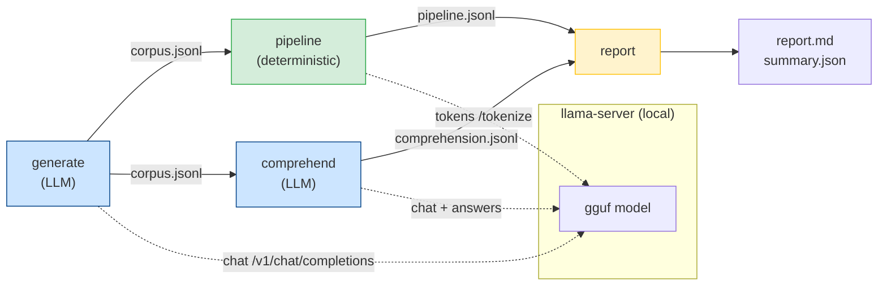

# toon-evals — Documentation

The eval harness measures the **quality** of the toon-mcp compression pipeline
(as opposed to `toon-mcp-bench`, which measures latency). It drives a local,
OpenAI-compatible `llama-server` to synthesize realistic structured payloads and
to act as a reading subject, then scores the pipeline deterministically.

Blue stages require the model server; the green stage is deterministic and only
contacts the server for exact token counts (it degrades gracefully when the
server is down).

## Read in this order

| Doc                                | What it covers                                                                                              |
| ---------------------------------- | ----------------------------------------------------------------------------------------------------------- |
| [usage.md](usage.md)               | Commands (`just` + raw `cargo`), the `serve.sh` server manager, and llama.cpp HTTP interfacing              |
| [architecture.md](architecture.md) | Crate layout, module dependencies, and end-to-end data flow                                                 |
| [methodology.md](methodology.md)   | How corpora are generated, how the pipeline is scored, and how comprehension questions are built and graded |
| [metrics.md](metrics.md)           | The four metric axes, their formulas, and how to read `report.md` / `summary.json`                          |

For a quick start, see the harness [README](../README.md).

## The four metrics at a glance

| Axis                        | Question it answers                                                          | Stage      |
| --------------------------- | ---------------------------------------------------------------------------- | ---------- |
| **Token savings**           | How many context tokens does TOON actually save under the model's tokenizer? | pipeline   |
| **Round-trip fidelity**     | Does `encode → decode` reproduce the original value losslessly?              | pipeline   |
| **Classification accuracy** | Does the classifier assign the shape the data really is?                     | pipeline   |
| **Comprehension parity**    | Can the model answer questions about TOON as accurately as about JSON?       | comprehend |
