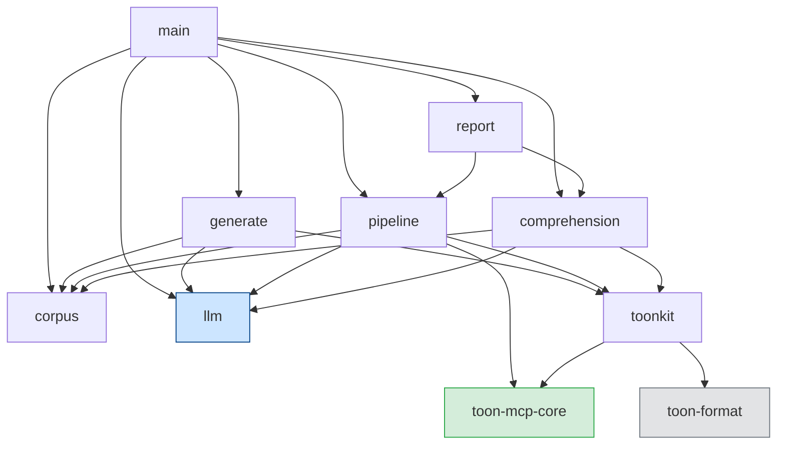
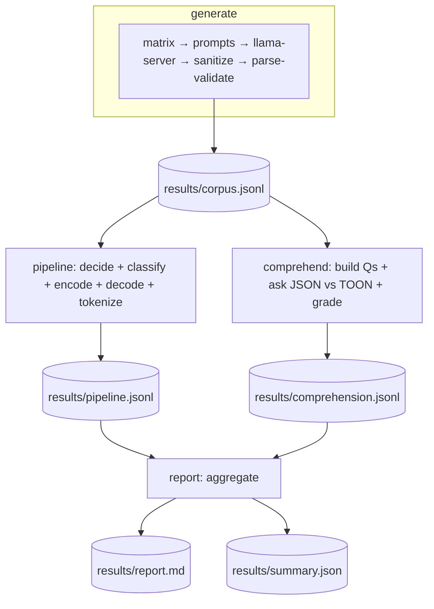
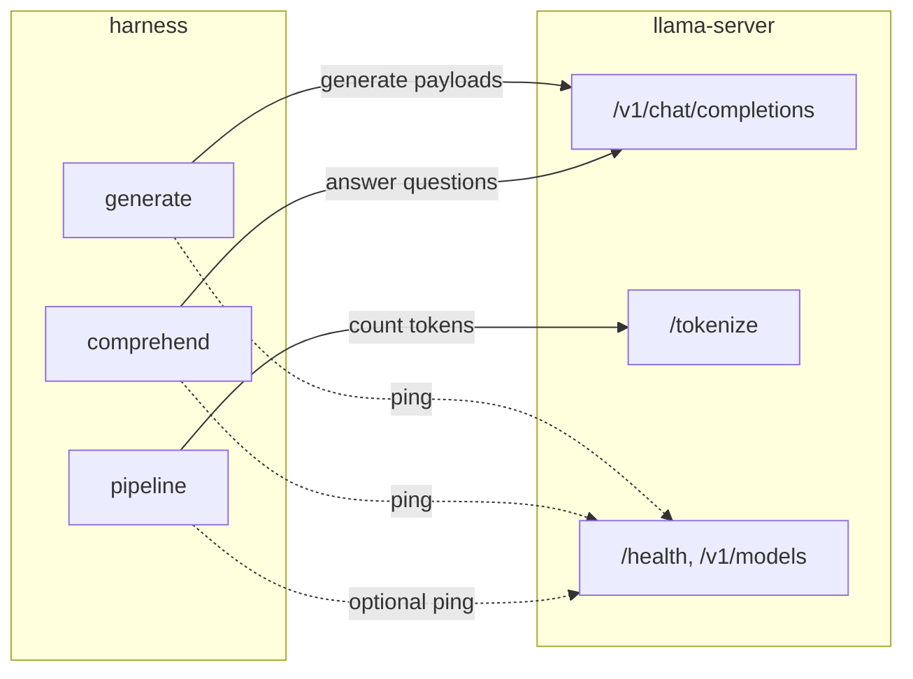

# Architecture

`toon-evals` is a single binary crate with its **own cargo workspace** (an empty
`[workspace]` table in `evals/Cargo.toml`). It is intentionally **not** a member
of the root toon-mcp workspace, so `cargo … --workspace` never builds it and it
cannot bloat the published crates' lockfile. It depends on `toon-mcp-core` by
path and on `toon-format` directly (for the encode→decode round-trip).

## Module map

| Module             | Responsibility                                                                           |
| ------------------ | ---------------------------------------------------------------------------------------- |
| `main.rs`          | CLI entry point; parses the subcommand + flags, resolves env config, orchestrates stages |
| `llm.rs`           | Blocking client for `llama-server`: chat completions, `/tokenize`, `/v1/models` ping     |
| `corpus.rs`        | `CorpusItem` model and JSONL read/append/write helpers                                   |
| `generate.rs`      | LLM-driven corpus synthesis across a format × shape × domain × size matrix               |
| `toonkit.rs`       | Bridges core parsing to `toon-format` encode/decode; tolerant value equality             |
| `pipeline.rs`      | Deterministic scorer: byte/token savings, round-trip, classification                     |
| `comprehension.rs` | Builds ground-truth questions and runs JSON-vs-TOON parity                               |
| `report.rs`        | Aggregates results into `report.md` + `summary.json`                                     |

## Module dependencies

`llm.rs` is the only module that performs network I/O. Everything else is pure
or file I/O, which is why the `pipeline` and `report` stages run without a
server.

## End-to-end data flow

Each stage reads/writes JSONL files under `results/`, so stages are
independently runnable and resumable.

## Where the model server fits

## Design decisions

- **Standalone workspace.** Keeps the network/TLS dependency tree (`ureq`,
  `rustls`) and the eval source out of the published crates entirely. The root
  manifest lists `evals` under `exclude`.
- **Deterministic where it matters.** Byte/token savings, round-trip, and
  classification are computed without any LLM judgment. Only _generation_ and
  _answering_ use the model; _grading_ is deterministic (see
  [methodology.md](methodology.md)).
- **Validate at generation time.** Generated payloads are parsed by the real
  core parser before being accepted, so later stages never choke on malformed
  model output.
- **Score independent of the byte gate.** The pipeline records what the server
  _would_ do (gated on byte ratio) **and** a self-encoded measurement for every
  parseable item, so token wins are visible even when the byte gate declines.
- **Exact tokens, not estimates.** Token counts come from the model's own
  `/tokenize` endpoint rather than a portable BPE approximation, so the figure
  matches the real context budget.

See [usage.md](usage.md) for how to drive these stages and
[metrics.md](metrics.md) for what the outputs mean.
