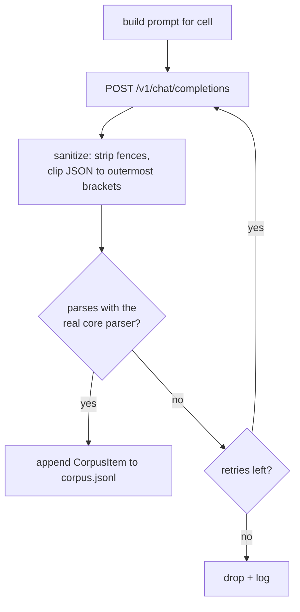
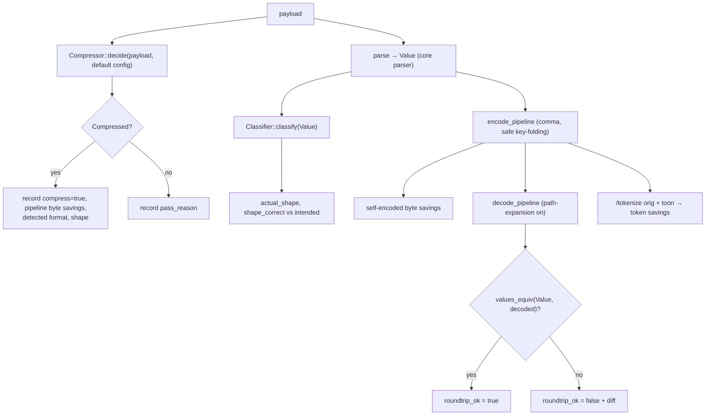
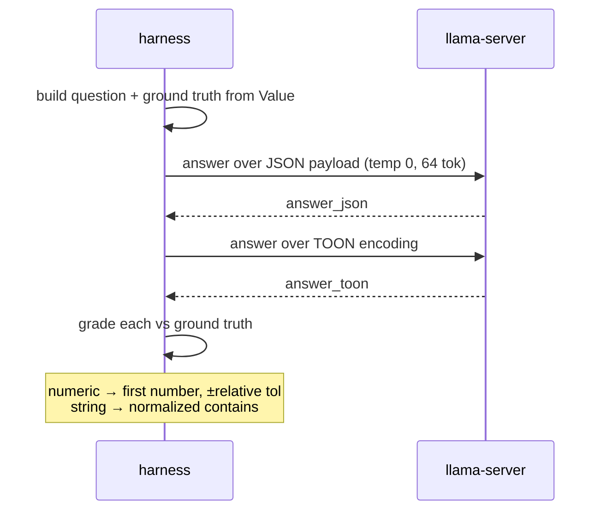

# Methodology

How each stage produces trustworthy numbers. The guiding principle: **the model
generates and answers; the harness grades deterministically.** No stage relies
on the model to judge correctness.

## Generation

`generate.rs` walks a matrix and asks the model for one payload per cell.

- **Formats × shapes.** `FORMAT_PLAN` pairs each format with the shapes that make
  sense for it:
  - `json` → tabular, fold_chain, primitive_array, mixed, pass_through
  - `jsonl` → tabular, mixed
  - `csv`, `tsv` → tabular
- **Sizes.** Each format requests several record counts (e.g. JSON ≈ 12 / 40 /
  120 records) so savings are measured across scales.
- **Domains.** A rotating list of 12 realistic domains (orders, telemetry,
  ledgers, tickets, …) keeps the data varied.
- **`per_cell`.** How many distinct payloads to request per (format, shape, size)
  cell — raise it for a larger corpus.

The system prompt forbids prose/fences and demands raw payload output;
`temperature 0.9` keeps the data varied.

### Accept only what parses

Model output is never trusted blindly:



`sanitize()` removes a wrapping `` ``` `` block and, for JSON, clips to the
outermost bracket pair. Validation uses the same parser (`JsonParser`,
`JsonlParser`, `CsvParser`) the production pipeline dispatches, with up to
`max_retries` (default 2) attempts per cell. Each accepted item is tagged with
its `intended_shape` — the ground truth for classification accuracy.

## Pipeline scoring

`pipeline.rs` runs two passes per item, both grounded in the real core.



Two key choices:

- **Gated vs ungated.** The first pass mirrors the server: `Compressor::decide`
  applies the byte-ratio gate (default: output ≤ 85% of input) and may pass an
  item through. The second pass _always_ parses, classifies, encodes, decodes,
  and tokenizes — so token savings and round-trip are measured even for items the
  byte gate rejects.
- **Round-trip is semantic.** The decoded value is compared to the _parsed_
  value (not the raw string) with `values_equiv`, which tolerates int/float
  representation drift (`30` vs `30.0`) within a small relative epsilon but flags
  any real corruption — wrong value, missing key, reordered array. Decoding uses
  `PathExpansionMode::Safe` so keys folded by safe key-folding are reconstructed
  into nested objects before comparison.

## Comprehension parity

`comprehension.rs` asks the model the _same_ question over the JSON form and the
TOON form, then grades both against an answer computed from the data.

### Finding records and building questions

`find_records` locates the first array of objects in the value tree (descending
through fold-chain wrappers). For each eligible item it builds up to three
questions whose answers are computed deterministically:

| Type     | Question                                                | Ground truth           |
| -------- | ------------------------------------------------------- | ---------------------- |
| `count`  | How many records are in the dataset?                    | `records.len()`        |
| `lookup` | Value of field `F` for the record whose key `K` is `k`? | the actual field value |
| `max`    | Maximum value of numeric field `N`?                     | `max` over the column  |

The key field prefers an `id`/`name`-like column; the lookup targets the middle
record for determinism.

### Asking and grading



- The answer system prompt instructs the model to reply with **only** the value.
- **Numeric** answers: extract the first number and compare within a small
  relative tolerance.
- **String** answers: normalize (trim quotes/punctuation/case) and accept exact
  match or substring containment.
- **Context budget.** Items whose payload exceeds `max_context_bytes` (default
  5000) are skipped so both representations fit comfortably in the context
  window.

Because the ground truth is computed from the parsed data — never from the model
— a divergence between JSON and TOON accuracy is attributable to the encoding,
not to grader bias.

See [metrics.md](metrics.md) for how these per-item results aggregate.
