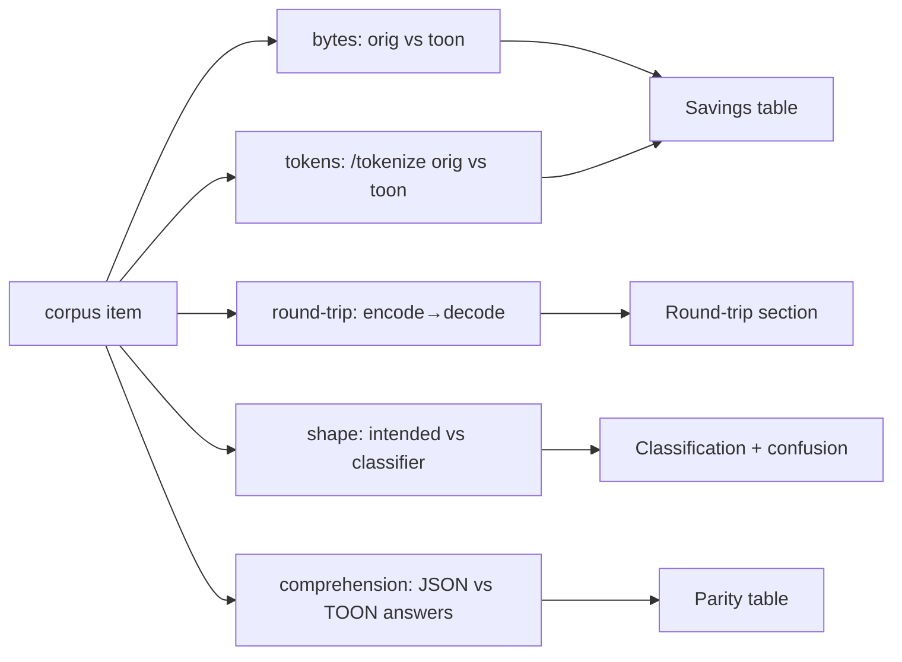

# Metrics

Definitions, formulas, and how to read the outputs. Per-item rows live in
`pipeline.jsonl` and `comprehension.jsonl`; `report.md` and `summary.json`
aggregate them.

## 1. Savings

Three related numbers, all in percent (higher = more saved):

| Metric                            | Formula                                 | Notes                                                                                          |
| --------------------------------- | --------------------------------------- | ---------------------------------------------------------------------------------------------- |
| **Token savings**                 | `(1 − toon_tokens / orig_tokens) × 100` | Token counts from the model's `/tokenize`. The real context-window win.                        |
| **Byte savings (self-encoded)**   | `(1 − toon_bytes / orig_bytes) × 100`   | Computed for every parseable item, independent of the byte gate.                               |
| **Pipeline byte savings (gated)** | `(1 − toon_bytes / orig_bytes) × 100`   | Only present when `Compressor::decide` actually compressed (output ≤ 85% of input by default). |

The report's **Savings** table breaks these down by group (ALL, per-format,
per-shape) alongside the compress-rate (share of items the gated pipeline
compressed). A dedicated line contrasts mean token vs mean byte savings:

> Byte ratio is what the pipeline _gates_ on; token savings is what the model
> actually _experiences_. A positive token-minus-byte delta means TOON saves
> more tokens than its byte shrinkage alone implies (keys collapse into single
> tokens) — the case for compression beyond the raw byte view.

## 2. Round-trip fidelity

For each parseable item: `parse → encode → decode`, then `values_equiv` against
the parsed value (path-expansion on; int/float drift tolerated). The report
shows **Tested / Lossless / Failures**, and lists failing items with a truncated
diff. **Any failure is a correctness bug** — TOON is lossless by design, so the
target is zero.

## 3. Classification accuracy

`actual_shape` (from `Classifier::classify`) vs the generator's
`intended_shape`. The report prints overall accuracy plus an
intended → actual confusion table (mismatches flagged). Some disagreement is
expected — the generator's intent is a _request_, and the model may emit data
that genuinely classifies differently — so read the confusion table, not just
the headline percent.

## 4. Comprehension parity

Per question type (`count`, `lookup`, `max`) and overall:

| Column      | Meaning                                                     |
| ----------- | ----------------------------------------------------------- |
| `acc(JSON)` | Share of answers correct when the model reads the JSON form |
| `acc(TOON)` | Share correct when it reads the TOON form                   |
| parity Δ    | `acc(TOON) − acc(JSON)`, in points                          |

Interpretation: **Δ near zero ⇒ TOON preserves comprehension**; a large negative
Δ ⇒ compression is costing the model accuracy. `acc(JSON)` is also a useful
sanity floor — if it is low, the questions or the model (not TOON) are the
limiting factor.

## Pass-through reasons

When the gated pipeline declines to compress, it records why. These mirror
`toon-mcp-core`'s `PassThroughReason`:

| Reason                 | Meaning                                           |
| ---------------------- | ------------------------------------------------- |
| `below_min_bytes`      | Smaller than `min_bytes` (default 256)            |
| `unknown_format`       | Not detected as JSON/JSONL/CSV/TSV                |
| `shape_not_beneficial` | Classifier returned a pass-through shape          |
| `insufficient_savings` | Encoded output exceeded the byte-ratio gate       |
| `parse_failed`         | Detected but failed to parse                      |
| `encode_failed`        | Parsed but TOON encoding failed                   |
| `input_exceeds_limit`  | Larger than `max_input_bytes` (library-only path) |

A healthy corpus shows mostly compressed items plus expected `below_min_bytes` /
`shape_not_beneficial` / `insufficient_savings` for the small/irregular
`pass_through` cells. `parse_failed` / `encode_failed` here would indicate a real
problem.

## summary.json

Machine-readable headline numbers for trend tracking:

| Field                                     | Source                                 |
| ----------------------------------------- | -------------------------------------- |
| `items`                                   | pipeline rows                          |
| `compress_rate_pct`                       | share compressed by the gated pipeline |
| `mean_byte_savings_pct`                   | mean self-encoded byte savings         |
| `mean_token_savings_pct`                  | mean token savings                     |
| `roundtrip_tested` / `roundtrip_failures` | fidelity counts                        |
| `classification_accuracy_pct`             | intended vs actual                     |
| `comprehension_questions`                 | total questions graded                 |

## Per-item columns (pipeline.jsonl)

Useful for ad-hoc analysis (e.g. with `duckdb` or `jq`):

| Field                                              | Meaning                               |
| -------------------------------------------------- | ------------------------------------- |
| `compressed`, `pass_reason`                        | gated decision and reason             |
| `detected_format`, `actual_shape`, `shape_correct` | detection + classification            |
| `pipeline_toon_bytes`, `pipeline_byte_savings_pct` | gated, compressed-only                |
| `toon_bytes`, `byte_savings_pct`                   | self-encoded, all parseable items     |
| `orig_tokens`, `toon_tokens`, `token_savings_pct`  | exact tokenizer counts                |
| `roundtrip_ok`, `roundtrip_detail`                 | fidelity + diff on failure            |
| `error`                                            | non-empty if parsing/encoding errored |

See [methodology.md](methodology.md) for how these values are produced.
