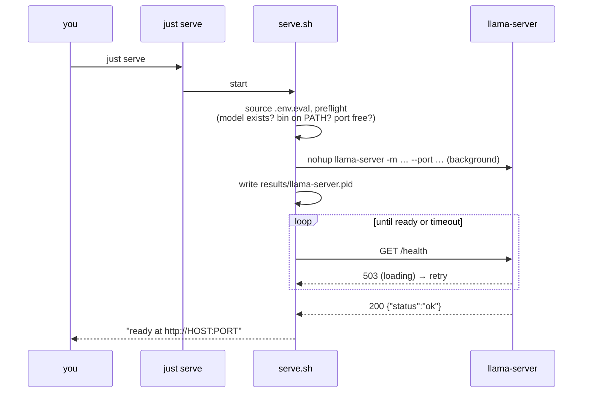
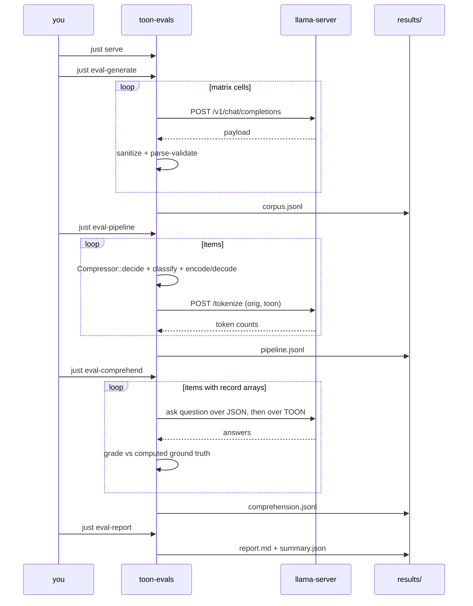

# Usage

All commands assume you are at the repository root (where the `justfile` lives).
The `just` recipes are thin wrappers; the raw `cargo` / `serve.sh` equivalents
are shown alongside.

## Prerequisites

- A built [`llama.cpp`](https://github.com/ggml-org/llama.cpp) `llama-server` on
  your `PATH` (or set `TOON_EVAL_LLAMA_BIN`).
- A local `.gguf` model.
- Rust (the harness pins its own toolchain via the parent `rust-toolchain.toml`).
- `just` (optional but recommended).

## 1. Configure the server

Nothing host-specific is committed. Copy the template and edit your private copy
(it is gitignored):

```bash
cp evals/.env.eval.example evals/.env.eval
```

`serve.sh` and every `just serve*` recipe source `evals/.env.eval` automatically.

| Variable                  | Default                 | Meaning                                                       |
| ------------------------- | ----------------------- | ------------------------------------------------------------- |
| `TOON_EVAL_MODEL_PATH`    | _(required)_            | Absolute path to the `.gguf` model                            |
| `TOON_EVAL_PORT`          | `8080`                  | Server port                                                   |
| `TOON_EVAL_HOST`          | `127.0.0.1`             | Bind address (local only)                                     |
| `TOON_EVAL_CTX_SIZE`      | `8192`                  | Context window; raise (e.g. `32768`) if the model supports it |
| `TOON_EVAL_NGL`           | `99`                    | GPU layers to offload (Metal/CUDA); lower if VRAM-limited     |
| `TOON_EVAL_LLAMA_BIN`     | `llama-server`          | Server binary name/path                                       |
| `TOON_EVAL_EXTRA_ARGS`    | _(empty)_               | Extra flags appended to the launch verbatim                   |
| `TOON_EVAL_START_TIMEOUT` | `180`                   | Seconds to wait for readiness on `start`                      |
| `TOON_EVAL_BASE_URL`      | `http://localhost:8080` | URL the eval client calls                                     |
| `TOON_EVAL_MODEL`         | `local-model`           | `model` field in chat requests (cosmetic)                     |
| `TOON_EVAL_RESULTS`       | `results`               | Output directory                                              |

## 2. Manage the server

| `just` recipe        | `serve.sh`                  | What it does                                                |
| -------------------- | --------------------------- | ----------------------------------------------------------- |
| `just serve`         | `evals/serve.sh start`      | Launch in the background; **wait until `/health` is ready** |
| `just serve-status`  | `evals/serve.sh status`     | Report running state + a health check                       |
| `just serve-logs`    | `evals/serve.sh logs`       | `tail -f` the server log                                    |
| `just serve-stop`    | `evals/serve.sh stop`       | Graceful stop (escalates to KILL)                           |
| `just serve-restart` | `evals/serve.sh restart`    | Stop then start                                             |
| `just serve-fg`      | `evals/serve.sh foreground` | Run in the foreground (Ctrl-C to stop)                      |

Extra `serve.sh` subcommand: `wait [seconds]` blocks until `/health` is ready
(useful in scripts). Background logs and the pidfile live under
`results/llama-server.{log,pid}`.

### Startup sequence



## 3. Run the evaluation

| `just` recipe                          | Raw equivalent (in `evals/`)                      | Server?   |
| -------------------------------------- | ------------------------------------------------- | --------- |
| `just eval-all [per_cell] [max_items]` | `cargo run --release -- all`                      | yes       |
| `just eval-generate [per_cell]`        | `cargo run --release -- generate --per-cell N`    | yes       |
| `just eval-pipeline`                   | `cargo run --release -- pipeline`                 | optional¹ |
| `just eval-comprehend [max_items]`     | `cargo run --release -- comprehend --max-items N` | yes       |
| `just eval-report`                     | `cargo run --release -- report`                   | no        |
| `just eval-build`                      | `cargo build --release`                           | no        |
| `just eval-clean`                      | `rm -rf results`                                  | no        |

¹ `pipeline` runs without a server; the token-savings columns are simply left
empty when the server is unreachable.

### A full session



## 4. llama.cpp HTTP interfacing

`llm.rs` talks to four endpoints over the OpenAI-compatible server (`ureq`,
blocking):

| Endpoint               | Method | Used for                                                      |
| ---------------------- | ------ | ------------------------------------------------------------- |
| `/v1/models`           | GET    | Reachability ping (`LlmClient::ping`)                         |
| `/health`              | GET    | Readiness polling in `serve.sh` (200 = loaded, 503 = loading) |
| `/v1/chat/completions` | POST   | Generation and comprehension answers                          |
| `/tokenize`            | POST   | **Exact** token counts under the loaded tokenizer             |

**Chat request** (`generate`, `comprehend`):

```json
{
  "model": "local-model",
  "temperature": 0.9,
  "max_tokens": 4096,
  "messages": [{ "role": "system", "content": "…" }, { "role": "user", "content": "…" }]
}
```

The assistant text is read from `choices[0].message.content`. Generation uses
`temperature 0.9`; comprehension answering uses `temperature 0.0`, `max_tokens 64`
for terse, deterministic replies.

**Tokenize request/response** (`pipeline`):

```json
// request
{ "content": "…text…" }
// response
{ "tokens": [1, 2, 3, …] }
```

The token count is `tokens.len()`. Because this is the server's own tokenizer,
the savings figure reflects the _actual_ context budget for that model rather
than a generic BPE estimate.

> Connection settings: a 10 s connect timeout and a 600 s global timeout (local
> generation can be slow). Override the bind/port with `TOON_EVAL_HOST` /
> `TOON_EVAL_PORT`, and the client URL with `TOON_EVAL_BASE_URL`. If you change
> the port, set `TOON_EVAL_BASE_URL` to match.

## Outputs

Everything lands in `evals/results/` (gitignored):

| File                     | Contents                                              |
| ------------------------ | ----------------------------------------------------- |
| `corpus.jsonl`           | Generated payloads + intended shape/format/domain     |
| `pipeline.jsonl`         | Per-item byte/token/round-trip/classification metrics |
| `comprehension.jsonl`    | Per-question JSON/TOON answers + correctness          |
| `report.md`              | Human-readable aggregate report                       |
| `summary.json`           | Machine-readable headline numbers                     |
| `llama-server.{log,pid}` | Background server log and pidfile                     |

See [metrics.md](metrics.md) for how to read the report.
